# Cookie Cutter Templates of the TikZlings

Find below .stl files for cookie cutters of the TikZlings. Note that they are mostly automatically generated, so some of the body parts might be too small and break off during baking, but they should nevertheless be tasty :)

&nbsp; | &nbsp; | &nbsp; |
---|:---:|---
 duck|  | <a href="./stls/duck.stl">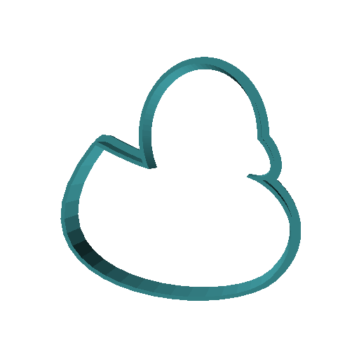</a> 
 anteater|  |  
 ape| 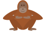 | <a href="./stls/ape.stl">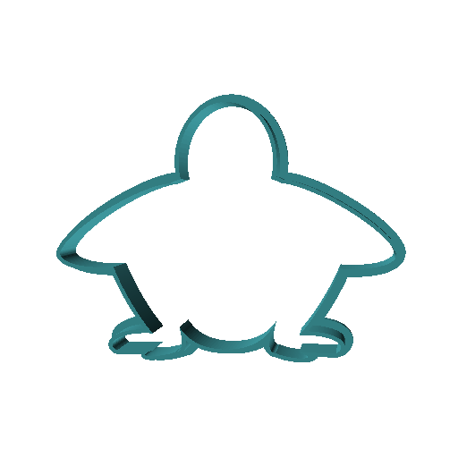</a> 
 bat|  |  
 bear|  |  
 bee| 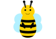 |  
 bug| 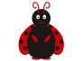 | <a href="./stls/bug.stl">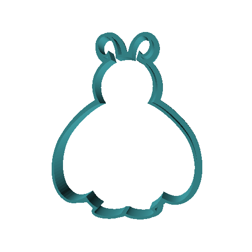</a> 
 cat|  |  
 chicken| 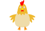 |  
 coati| 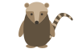 |  
 elephant| 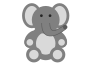 | <a href="./stls/elephant.stl">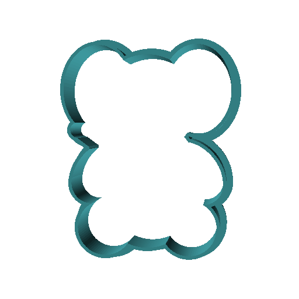</a> 
 hippo|  |  
 koala|  |  
 marmot|  |  
 meerkat|  |  
 mouse|  |  
 moles|  |  
 owl| 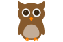 | <a href="./stls/owl.stl">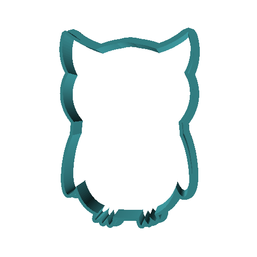</a> 
 panda|  |  
 penguin|  |  
 pig| 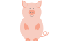 |  
 rhino| 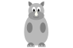 |  
 sheep| 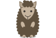 | <a href="./stls/sheep.stl">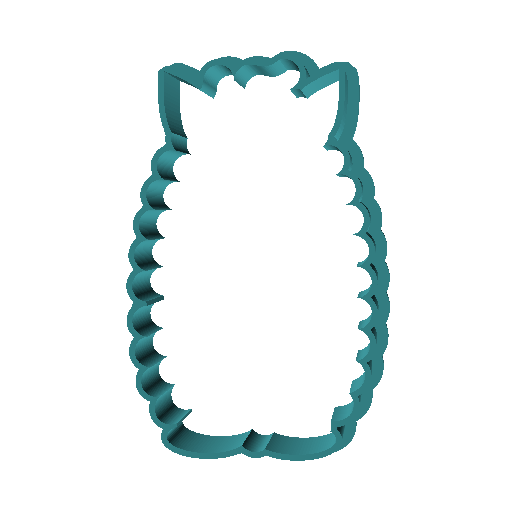</a> 
 sloth|  |  
 snowman| 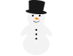 |  
 squirrel| 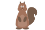 | <a href="./stls/squirrel.stl">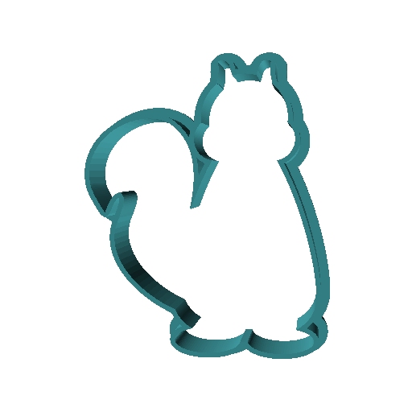</a> 
 wolf| 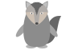 |  