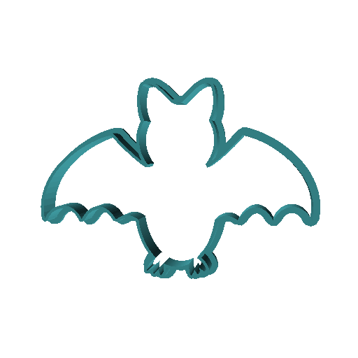
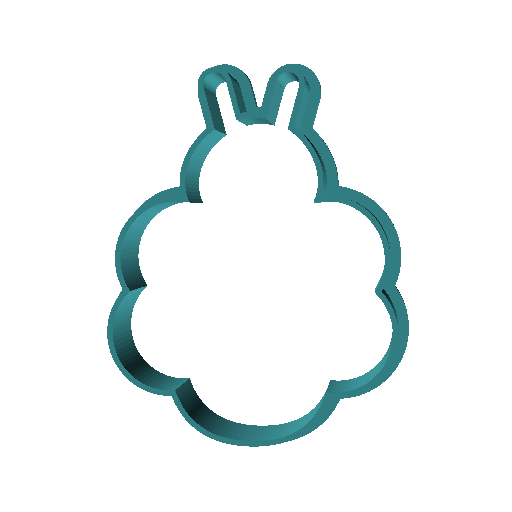
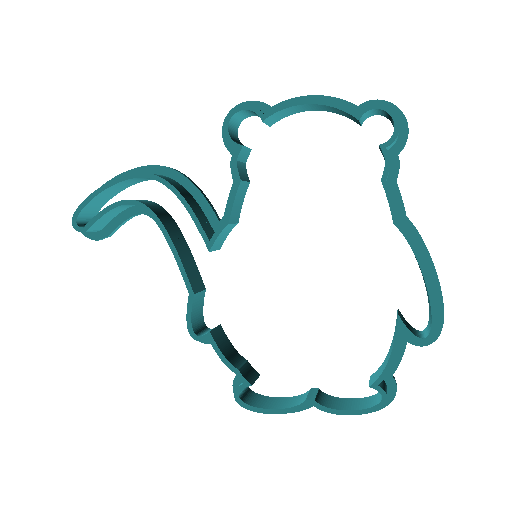
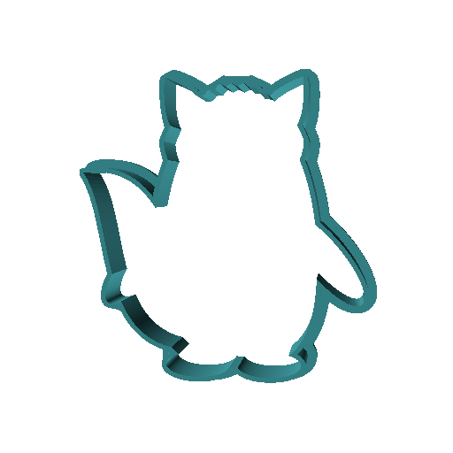

# Cookie Cutter Templates of the TikZlings

Find below .stl files for cookie cutters of some of the TikZlings. Note that they are automatically generated based on the TikZ code, so some of the body parts might be too small and break off during baking, but they should nevertheless be tasty :)

